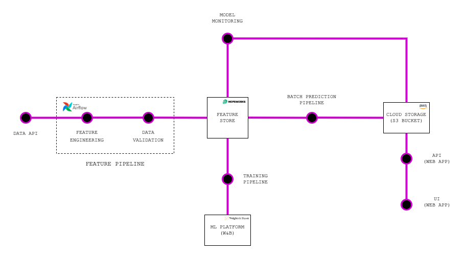
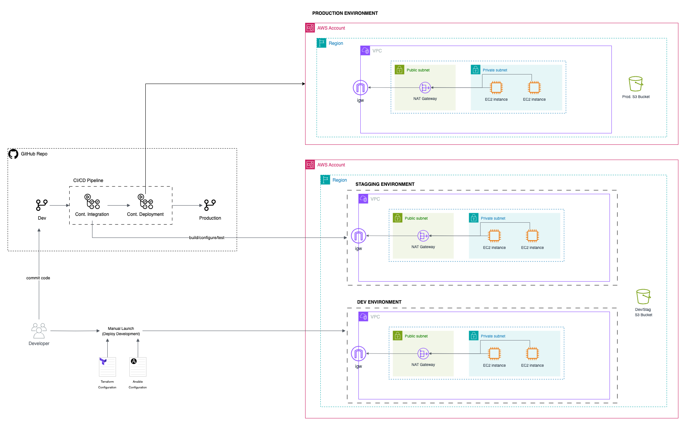
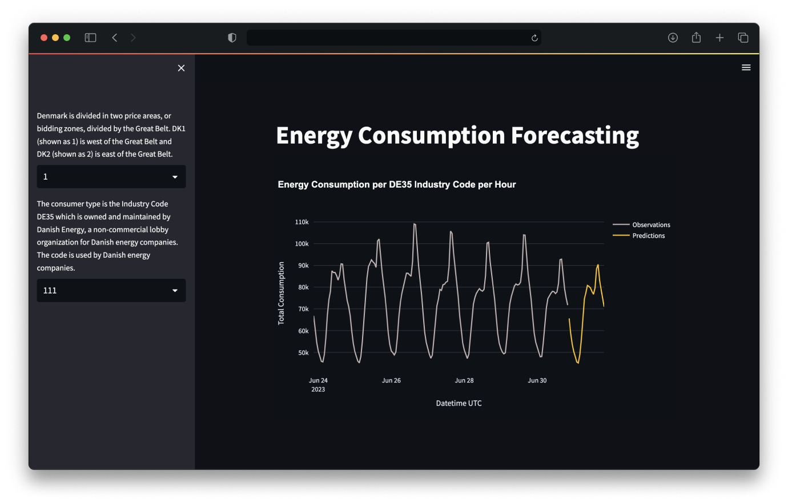
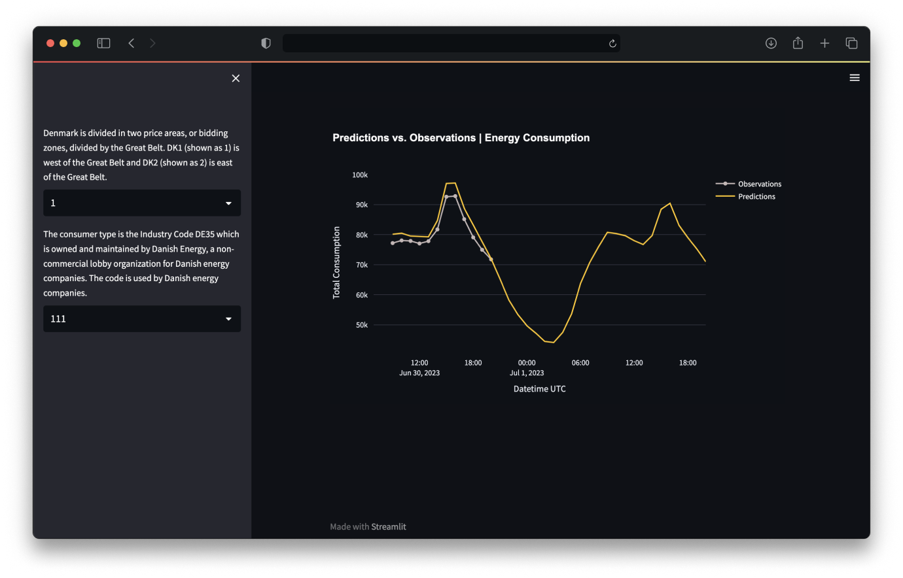

# Energy Consumption Forecasting

This project aims to forecast the energy consumption of the different regions of Denmark, allowing ML-driven decisions to 
allocate resources efficiently.

## Table of Content

- [ML Lifecycle](#ml-lifecycle)
- [Infrastructure](#infrastructure)
    - [Architecture](#architecture)
- [Configuration](#how-to-run)
    - [Credentials](#credentials)
    - [Build with Terraform](#build-with-terraform)
    - [Configure with Ansible](#configure-with-ansible)
- [Local Debugging](#local-debugging)
- [Project Structure](#project-structure)
- [Main Stack](#main-stack)
- [User Interface](#user-interface)

## ML Lifecycle
The ML Lifecycle uses batch processing with an FTI(Feature-Training-Inference) methodoloy, allowing to decouple the different components of this pipeline, sticking to good MLOps practices. Also a monitoring step to calculate the error of the predictions on a hourly basis.

The data is served by two UIs or via REST APIs.



## Infrastructure

### Architecture 


## How to Run?

### Credentials

To configure the credentials values there are two possible ways: 

1. Create .env files based on the .env.default values of the different folders and set values.

- Folders to check 
- src/app-api 
- batch-prediction-pipeline 
- training-pipeline 
- feature-pipeline 

2. Set all necesary credentials as environment variables, a 'settings.py' file will automatically load the variables.

```bash 
export FS_API_KEY=${value}
export FS_PROJECT_NAME=${value}  
export WANDB_API_KEY=${value}  
export WANDB_ENTITY=${value}  
export WANDB_PROJECT=${value}  
export AWS_ACCESS_KEY_ID=${value}  
export AWS_SECRET_ACCESS_KEY=${value}  
export AWS_BUCKET_NAME=${value}  
```

### Build with Terraform 

1. Configure credentials (if were not already defined as env variables)
```bash 
export AWS_ACCESS_KEY_ID=${value}  
export AWS_SECRET_ACCESS_KEY=${value}  
```

2. Run the follwing command:
```bash
cd infrastructure/terraform
terraform plan
terraform apply -auto-approve
```

### Configure with Ansible

1. Upload your keypair
```bash
mkdir {WORKDIR}/infrastructure/ansible/keys                                             # Create key folder
mv {KEYPAIR_PATH}/TF_EnergyConsumption.pem {workdir}/infrastructure/ansible/keys        # Upload your key
```

2. Configure API keys
There is a default file with all the necessary APIs keys
```bash 
cat {ANSIBLE_PATH}/inventories/dev/group_vars/secrets.default.yml >> secrets.test.yml    # Configure all the API keys in a new file    
ansible-vault encrypt {ANSIBLE_PATH}/inventories/dev/group_vars/secrets.enc.yml
```

3. Configure ansible-vault password
```bash
{your_ansible_password} >> {ANSIBLE_PATH}/inventories/dev/group_vars/secrets-key
```

4. Configure IP addresses
*This can be done after deploying your infrastructure, because public IP addresses for the servers are randomly assigned from a pool.*
Open the following file: {ANSIBLE_PATH}/inventories/dev/hosts.ini and replaced the IP addresses.

5. Configurate servers.
Once all previous steps are correctly done, configure the servers running the following command:
```bash
ansible-playbook system.yml
```

*Configurations takes between 5-10 minutes*

## LOCAL DEBUGGING
>[NOTE!]
> Make sure the configure all the credentials before

To debug the application locally, run the following commands: 

```bash
docker-compose build src/airflow/
docker-compose up src/airflow/

docker-compose build src/deploy/
docker-compose up src/deploy
```

## PROJECT STRUCTURE
The project main structure is as follows:
```
├── README.md                       -> Lorem Ipsum is simply dummy text of the printing and typesetting industry  
├── .github/workflows               -> Lorem Ipsum is simply dummy text of the printing and typesetting industry
│   ├── CI/CD Pipelines             -> Lorem Ipsum is simply dummy text of the printing and typesetting industry
├── infastructure                   -> Lorem Ipsum is simply dummy text of the printing and typesetting industry
│   ├── ansible                     -> Lorem Ipsum is simply dummy text of the printing and typesetting industry
│   │   ├── group_vars              -> Lorem Ipsum is simply dummy text of the printing and typesetting industry
│   │   ├── playbooks               -> Lorem Ipsum is simply dummy text of the printing and typesetting industry
│   │   └── hosts.ini               -> Lorem Ipsum is simply dummy text of the printing and typesetting industry
│   ├── terraform                   -> Lorem Ipsum is simply dummy text of the printing and typesetting industry
│   │   ├── modules
│   │   ├── xxx
│   │   └── xxx
├── src               
│   ├── airflow                     
│   ├── app-api                     
│   ├── app-frontend                
│   ├── app-monitoring              
│   ├── batch-prediction-pipeline   
│   ├── deploy                      
│   ├── feature-pipeline            
│   ├── training-pipeline           
```


## Main Stack

### Frontend
- [Streamlit](https://streamlit.io/) - The UI to visualize data metrics and predictions

### Backend
- [FastAPI](https://fastapi.tiangolo.com/) - The API to communicate with website application

### MLOps
- [Airflow](https://airflow.apache.org/) - Scheduling, managing and running the different pipelines
- [Hopsworks](https://www.hopsworks.ai/) - The feature store used to versionize the data
- [Weights&Biases](https://wandb.ai/site) - Logging and saving models metrics and model registry

### DevOps
- [GitHubs Actions](https://github.com/features/actions) - The CI/CD Pipeline
- [Docker / Docker-Compose](https://www.docker.com/) - Contarize components
- [Terraform](https://www.terraform.io/) - Provision and manage resources in the AWS
- [Ansible](https://www.ansible.com/) - Automate configuration of AWS resources


## User Interface
Two different webpages UI were built, the fisrt one for visualizing the forecasting data of the differents zones, while the other allows to compare the predicted data with the truth data collected each hour.

<table width="100%"> 
<tr>
<td width="50%">      
&nbsp; 
<br>
<p align="center">
  PREDICTION
</p>

</td> 
<td width="50%">
<br>
<p align="center">
  MONITORING
</p>
  
</td>
</table>